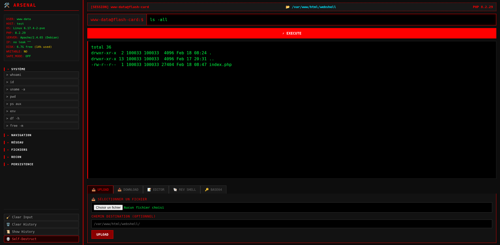

# full-webshell


> Interface web PHP tout-en-un pour l'administration de serveur, le pentest et la reconnaissance système.

## Aperçu




---

## 📋 Description


- Exécution de commandes système en temps réel
- Upload et téléchargement de fichiers
- Éditeur de fichiers intégré
- Générateur de reverse shell (10 langages)
- Encodeur/décodeur Base64
- Reconnaissance système automatisée
- Auto-destruction du shell

L'interface est responsive, avec un thème sombre inspiré des terminaux, une sidebar d'outils prédéfinis et un système d'onglets.

---

## ⚙️ Prérequis

- **PHP** ≥ 7.0 avec les fonctions suivantes activées :
  - `shell_exec`
  - `session_start`
  - `file_put_contents` / `file_get_contents`
  - `move_uploaded_file`
- **Serveur web** : Apache, Nginx ou tout serveur compatible PHP
- Les sessions PHP doivent être activées

---

## 🚀 Installation

1. Cloner le dépôt ou copier le fichier :

```bash
git clone <url-du-repo>
```

2. Placer `file_Upload.php` dans le répertoire web du serveur (ex: `/var/www/html/`).

3. Accéder via le navigateur :

```
http://<ip-serveur>/file_Upload.php
```

Aucune dépendance externe n'est requise — tout est contenu dans un seul fichier PHP.

---

## 🛠️ Fonctionnalités

### 1. Terminal de commandes
- Exécution de commandes via `shell_exec`
- Répertoire de travail persistant (session PHP)
- Historique des commandes sauvegardé en `localStorage`
- Navigation dans l'historique avec les flèches ↑/↓

### 2. Arsenal (Sidebar)
Commandes prédéfinies classées par catégorie :

| Catégorie     | Exemples de commandes                              |
|---------------|-----------------------------------------------------|
| **Système**   | `whoami`, `id`, `uname -a`, `ps aux`, `df -h`      |
| **Navigation**| `ls -la`, `find . -type f`, `du -sh *`              |
| **Réseau**    | `ip a`, `netstat -tunlp`, `curl ifconfig.me`        |
| **Fichiers**  | `cat /etc/passwd`, `find / -perm -4000`             |
| **Recon**     | `cat /etc/crontab`, `cat /etc/sudoers`              |
| **Persistence**| `crontab -l`, `systemctl list-unit-files`           |

### 3. Upload de fichiers
- Sélection de fichier via formulaire
- Chemin de destination personnalisable
- Upload par défaut dans le répertoire de travail courant

### 4. Téléchargement de fichiers
- Téléchargement de n'importe quel fichier lisible sur le serveur
- Envoi en `application/octet-stream`

### 5. Éditeur de fichiers (Broken)
- Chargement du contenu d'un fichier distant
- Modification en ligne via `textarea`
- Sauvegarde directe sur le serveur

### 6. Générateur de Reverse Shell
Supporte 10 types de payloads :

- Bash (`-i`, UDP)
- Python / Python3
- PHP
- Perl
- Netcat (`-e`, mkfifo)
- Ruby
- Socat

Configuration de l'IP et du port, avec commande listener générée automatiquement.

### 7. Encodeur/Décodeur Base64
- Encodage et décodage côté client (JavaScript)
- Copie rapide du résultat

### 8. Informations système
Affichées dans la sidebar :
- Utilisateur, hostname, OS, version PHP
- Logiciel serveur, adresse IP
- Espace disque, droits d'écriture, safe mode

### 9. Auto-destruction
- Suppression du fichier PHP du serveur via `?selfdestruct=confirm`
- Confirmation requise avant exécution

---

## 📁 Structure du projet

```
file_upload/
├── file_Upload.php   # Script principal (tout-en-un)
└── README.md         # Documentation
```

---

## ⚠️ Avertissement légal

> **Ce projet est fourni à des fins strictement éducatives et de recherche en sécurité.**
>
> L'utilisation de cet outil sur des systèmes sans autorisation explicite est **illégale** et peut entraîner des poursuites pénales. L'auteur décline toute responsabilité en cas d'utilisation malveillante.
>
> Utilisez uniquement dans un environnement contrôlé (lab, CTF, pentest autorisé).

---

## 📜 Licence

Usage éducatif uniquement. Aucune garantie fournie.
